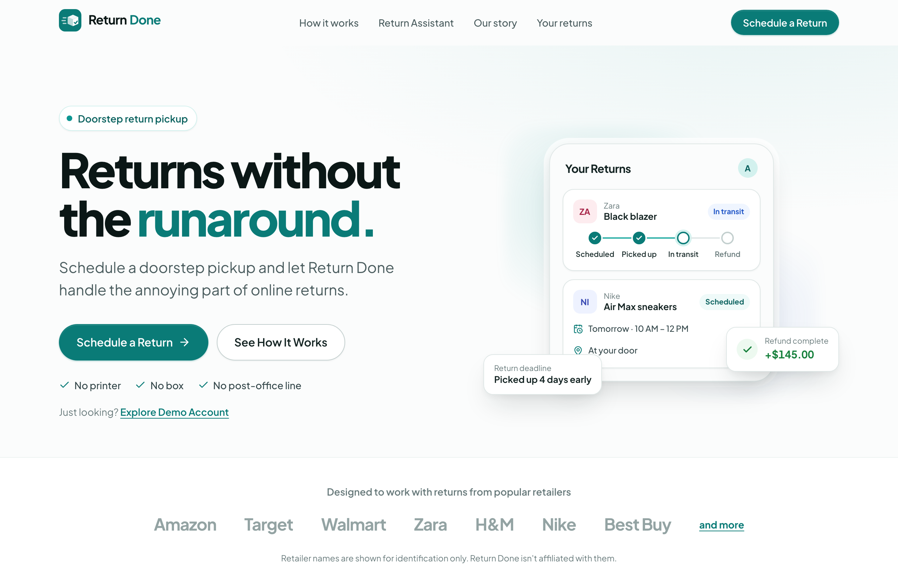
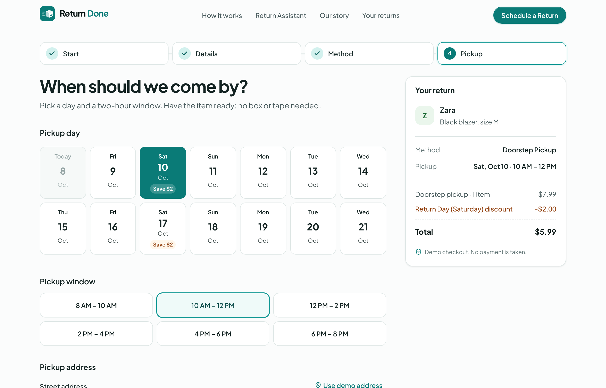
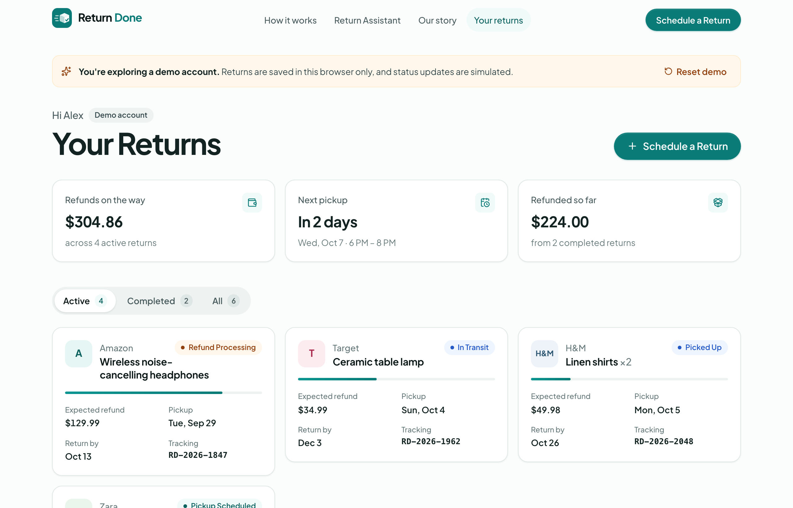
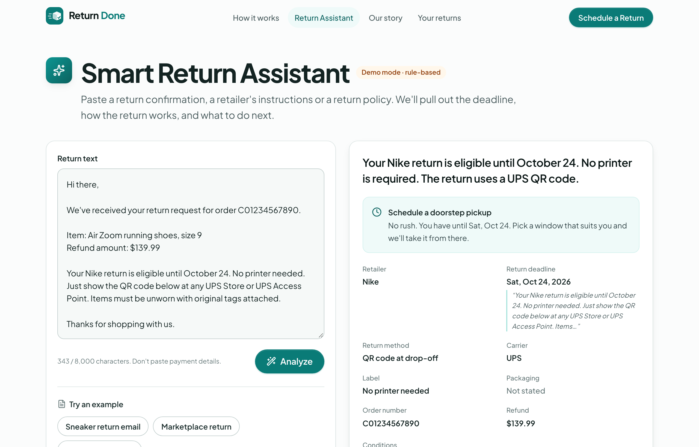

<p align="center">
  
</p>

<h1 align="center">Return Done</h1>

<p align="center">
  <strong>Returns without the runaround.</strong><br />
  Doorstep pickup and refund tracking for online returns.
</p>

<p align="center">
  <a href="https://return-done.vercel.app"><strong>Live demo</strong></a> ·
  <a href="#the-story">The story</a> ·
  <a href="#architecture">Architecture</a> ·
  <a href="#getting-started">Run it locally</a>
</p>

---

Return Done is a consumer service for the most annoying part of online shopping: sending things back. You tell
us what you're returning and pick a two-hour window. We collect it from your door, then pack, label and drop it
off. You follow the return and your refund in one place.

It started as a real startup in Chicago in 2023. This repository is the 2026 rebuild.

## The idea

Buying online takes a minute. Returning something still looks like this:

> Find the instructions → print a label → find a box → pack it → drive to a carrier or store → wait in line →
> keep checking whether the refund arrived.

Every retailer does it a little differently, deadlines are easy to miss, and the work lands on the customer.
Return Done replaces it with:

> **Schedule → we pick it up → track your refund.**

## The story

Return Done was co-founded in Chicago in 2023 by four graduate students at Illinois Institute of Technology.
We built the product ourselves: a return request form, pickup scheduling, online payment, customer
confirmations and an operations inbox for every request. Then we tested it for real.

We put posters up around the Illinois Tech campus, signed up a small number of student customers and ran
actual doorstep pickups. Items were checked at the door, packed and labeled, and taken back to the retailer.
The concept held up at that early stage: people wanted it, and the software did its job.

## Why we stopped

The experiment showed us that the hard part of Return Done wasn't the software. It was last-mile logistics:
routing, timing, verifying items, carrier and store cut-offs, and customers who aren't home. Each of those
gets harder as volume grows. With a team of four, we chose not to keep scaling the operation.

We count that as a useful result. A small, real test answered the question it needed to answer.

## The 2026 rebuild

This repository modernizes the original product using current engineering practice, and explores how
automation and AI could make returns easier still. The goals:

- Keep what worked: the business rules and the flow customers actually used.
- Rebuild the rest properly: a typed domain model, validated APIs, a real design system, accessibility and
  tests.
- Add one thoughtful AI feature, without turning the product into an AI company.

## Product features

Everything below is implemented and works in the demo without any external services.

- **Landing page:** problem framing, how it works, benefits, pricing, retailers, FAQ and the company story.
- **Return scheduling wizard:** four steps, with step-by-step validation and a confirmation screen.
  - **Start:** the customer's email for the confirmation (required, asked first), then a searchable
    retailer picker with an "Other retailer" option.
  - **Details:** item, count, order number, reason, refund amount, deadline, packaging, label, QR code and
    carrier. Only the item description is required.
  - **Method:** Doorstep Pickup, with what's included and the price.
  - **Pickup:** a mobile-friendly day picker, two-hour windows (8 AM to 8 PM) that close an hour before they
    start, the address and special instructions.
  - **Confirmation:** an `RD-2026-1847`-style tracking number, a summary, a "what happens next" timeline and
    tips.
- **Pricing rules:** $7.99 for a single item, $12.99 for two or more, and $2 off Saturday pickups ("Return
  Day", carried over from 2023). All configured in one file.
- **Customer dashboard ("Your Returns"):** refund totals, the next pickup, active/completed/all filters,
  return cards with status, progress, pickup date, deadline and tracking number, plus skeleton loading and
  empty states.
- **Return detail page:** a full status timeline (Scheduled → Picked Up → In Transit → Delivered → Refund
  Processing → Refund Complete), pickup, return and payment details, and a copyable tracking number. A clearly
  labelled demo control steps a return through its statuses.
- **Smart Return Assistant:** paste a confirmation email or return policy to extract the retailer, deadline
  (explicit, or computed from "30 days from delivery"), return method, carrier, label and packaging
  requirements, conditions, order number and refund amount. You get a plain-English summary, a recommended
  next step based on how close the deadline is, and a one-click hand-off that pre-fills the scheduling wizard.
  - It runs on a deterministic rule-based parser by default, with no API key needed.
  - If `ANTHROPIC_API_KEY` is set, it uses Claude for structured extraction and falls back to the parser on
    any failure.
  - The UI always says which engine produced the result.
- **Confirmation email:** the first step asks for the customer's email (required), and they get a "Your return is
  scheduled" email with the tracking number, pickup window, address and a tracking link. It's marked
  **[TEST]** with a banner saying it comes from a demo website. It sends once SMTP settings are added (see
  [Confirmation emails](#confirmation-emails)). Input is HTML-escaped, the address isn't stored, and an email
  failure never fails the booking.
- **Demo account:** six seeded returns, with dates generated relative to today so they never look stale.
  Data is kept in the browser, with a "Reset demo" control.
- **Polish:** a design system (tokens, buttons, cards, inputs, badges, status components, modal, toasts),
  page and step transitions, success animation, loading states, a polished 404 and an error boundary.
- **Accessibility:** semantic landmarks, a skip link, labelled controls, errors wired with `aria-describedby`,
  focus management between wizard steps, keyboard-operable radio groups, visible focus rings, AA-contrast
  colours and `prefers-reduced-motion` support.

## Architecture

```
src/
├── app/                      Next.js App Router
│   ├── page.tsx              Landing page
│   ├── schedule/             Scheduling wizard
│   ├── dashboard/            Your Returns
│   ├── returns/[id]/         Return detail + timeline
│   ├── assistant/            Smart Return Assistant
│   ├── about/                Our story
│   ├── api/returns/          POST: validate, price and create a return
│   ├── api/assistant/        POST: extract return details; GET: active engine
│   ├── not-found.tsx, error.tsx, robots.ts, sitemap.ts
│   └── globals.css           Design tokens + base styles
├── components/
│   ├── ui/                   Design system primitives
│   ├── layout/               Header, footer
│   ├── landing/              Landing sections
│   ├── schedule/             Wizard steps, summary, confirmation
│   ├── returns/              Cards, timeline, dashboard, detail views
│   └── assistant/            Assistant UI
└── lib/                      Framework-free domain logic (unit tested)
    ├── config.ts             Prices, pickup windows, site + founder links
    ├── returns.ts            Return model, status machine, deadlines, tracking numbers
    ├── pricing.ts            Quotes, including the Return Day discount
    ├── scheduling.ts         Pickup days and windows with lead-time rules
    ├── schemas.ts            zod schemas shared by client and server
    ├── return-draft.ts       Wizard form state → validated API payload
    ├── create-return.ts      Builds a new return record
    ├── returns-store.ts      Demo persistence (localStorage + useSyncExternalStore)
    ├── email/                Confirmation email, sender, fake-address check, send limits
    ├── demo-data.ts          Seeded returns relative to today
    └── assistant/            Rule-based extractor, Claude provider, summaries
```

| Layer      | Choice                                                                |
| ---------- | --------------------------------------------------------------------- |
| Framework  | Next.js 16 (App Router, Turbopack), React 19                          |
| Language   | TypeScript (strict, `noUncheckedIndexedAccess`)                       |
| Styling    | CSS Modules + CSS custom-property design tokens, Plus Jakarta Sans    |
| Validation | zod 4, shared by the browser and the API                              |
| AI         | Optional `@anthropic-ai/sdk` structured outputs; rule-based fallback  |
| Testing    | Vitest + Testing Library (unit, API route and full wizard flow tests) |
| Quality    | ESLint (`eslint-config-next`), Prettier, `tsc --noEmit`               |
| Hosting    | Vercel (zero config)                                                  |

**Request flow when you schedule a return.** The wizard validates each step on the client with the same zod
schemas the server uses. On submit, it posts to `POST /api/returns`. The handler validates the payload again,
checks the pickup date range, prices it and returns a typed `ReturnRecord` with a fresh tracking number. In
the demo, the browser stores that record. In production, this handler is where the database write, payment
and operations notification would go. That is exactly what the 2023 .NET API did, by email.

## Technical decisions

1. **Domain logic lives in `src/lib`, not in components.** Pricing, scheduling, the status machine,
   validation and the assistant's extractor are plain functions that take `now` as an argument. That makes
   them deterministic and easy to test: the test suite pins dates instead of mocking clocks.
2. **One schema, two sides.** zod schemas validate wizard steps in the browser and request bodies in the API,
   so client and server can't drift. The server never trusts the client's price or tracking number.
3. **Demo persistence behind a small store interface.** A portfolio demo shouldn't need a database to
   deploy. `returns-store.ts` exposes `getAll / get / add / advance / reset` over localStorage with
   `useSyncExternalStore`, so swapping in an API-backed repository touches one file. Server rendering shows
   skeletons rather than guessing, which avoids hydration mismatches.
4. **Dates as `YYYY-MM-DD` strings in local time.** That avoids the classic `new Date("2026-10-18")`
   UTC-midnight bug. Anything that depends on "today" waits for the client clock (`useNow`), so server and
   client HTML always match.
5. **AI with a deterministic floor.** The assistant has two engines behind one function and one output
   schema. The LLM path uses Claude structured outputs validated against that same zod schema. Dates are
   re-validated, summaries and next steps are computed by the same deterministic code, and any API failure
   falls back to the rule-based parser. The product works with no key, costs nothing to demo, and never
   claims AI was used when it wasn't.
6. **No UI framework.** A small token-based design system in CSS Modules keeps the bundle light and the look
   specific to this product. The only runtime dependencies are Next/React, zod, lucide icons and the optional
   Anthropic SDK.
7. **Preserve the original rules.** Two-hour windows from 8 AM to 8 PM, the same-day cutoff, Saturday Return
   Day pricing and earliest-deadline urgency all came from the 2023 code, and are now centralized in
   `config.ts` and covered by tests.

## Getting started

Requirements: Node.js 20.9 or newer (developed on Node 24) and npm.

```bash
git clone https://github.com/DisaleGita/Return-Done.git
cd Return-Done
npm install
npm run dev
```

Open http://localhost:3000. No environment variables are needed.

| Command              | What it does                                              |
| -------------------- | --------------------------------------------------------- |
| `npm run dev`        | Start the dev server                                      |
| `npm run build`      | Production build                                          |
| `npm start`          | Serve the production build                                |
| `npm test`           | Run the test suite once                                   |
| `npm run test:watch` | Tests in watch mode                                       |
| `npm run lint`       | ESLint                                                    |
| `npm run typecheck`  | TypeScript, no emit                                       |
| `npm run format`     | Prettier                                                  |
| `npm run check`      | Lint, typecheck, test and build: everything CI should run |

## Environment variables

All optional. Copy `.env.example` to `.env.local` to set them.

| Variable                                              | Purpose                                                                                                       |
| ----------------------------------------------------- | ------------------------------------------------------------------------------------------------------------- |
| `NEXT_PUBLIC_SITE_URL`                                | Public URL for links in emails, metadata and the sitemap. Optional on Vercel, which provides it automatically |
| `ANTHROPIC_API_KEY`                                   | Enables Claude for the Smart Return Assistant. Server-only; never exposed to the browser                      |
| `ANTHROPIC_MODEL`                                     | Overrides the assistant's model (default `claude-opus-5`)                                                     |
| `EMAIL_MODE`                                          | Optional override: `off`, `smtp` or `test` (fake Ethereal inbox). By default, email sends once SMTP is set    |
| `EMAIL_FROM`                                          | Sender shown on confirmation emails                                                                           |
| `SMTP_HOST` / `SMTP_PORT` / `SMTP_USER` / `SMTP_PASS` | SMTP server for real emails, e.g. Gmail: `smtp.gmail.com`, port `465`, your address, an app password          |
| `EMAIL_ALLOWED_RECIPIENTS`                            | Comma-separated addresses or `@domains` allowed to receive real email. Set this on public deployments         |
| `EMAIL_MAX_RECIPIENTS` / `EMAIL_MAX_PER_RECIPIENT`    | Cap on how many different people get email, and emails per address (default 3)                                |
| `KV_REST_API_URL` / `KV_REST_API_TOKEN`               | Upstash Redis for counting emails. Added automatically by Vercel's Upstash integration                        |
| `NEXT_PUBLIC_REPO_URL`                                | GitHub link used in the footer and About page                                                                 |
| `NEXT_PUBLIC_FOUNDER_LINKEDIN_URL`                    | Overrides the LinkedIn link on the About page                                                                 |

### Confirmation emails

Every booking starts by asking for the customer's email address, and they get a "Your return is
scheduled" email. Its
subject starts with **[TEST]**, and a banner at the top says it comes from a demo website: no real pickup
was booked, no driver will come and no payment was taken.

To send these to real inboxes, add SMTP settings to `.env.local` (or Vercel → Settings → Environment
Variables). With Gmail you don't need a domain:

1. Turn on 2-Step Verification for your Google account.
2. Create an app password at https://myaccount.google.com/apppasswords.
3. Set:
   ```bash
   SMTP_HOST=smtp.gmail.com
   SMTP_PORT=465
   SMTP_USER=you@gmail.com
   SMTP_PASS=your-16-character-app-password
   EMAIL_FROM="Return Done (demo)" <you@gmail.com>
   ```
4. Restart the app (or redeploy). Emails now send automatically.

Gmail allows roughly 500 emails a day, which is plenty for a demo. Any SMTP provider works the same way
(Resend, SendGrid, Postmark, Amazon SES), but those need a verified sending domain. Without SMTP settings,
no email is sent. `EMAIL_MODE=test` sends to a fake [Ethereal](https://ethereal.email) inbox instead, for
development.

#### Protecting a public demo

- **Fake addresses are turned away.** Test domains (`example.com`, `.test`), well-known throwaway inboxes
  (Mailinator, 10 Minute Mail, YOPmail and others) and domains with no mail or DNS records get "Please
  use a real email address", and the customer can correct it. If the DNS lookup itself fails, the address
  is allowed, so real customers are never blocked by a network hiccup.
- **A cap on how many people get email.** By default, once 50 different people have been emailed,
  bookings still work but no more email is sent, and the confirmation page says so. Each address gets
  at most 3 emails. Change these in `src/lib/config.ts` (`emailLimits`), or with `EMAIL_MAX_RECIPIENTS`
  and `EMAIL_MAX_PER_RECIPIENT` (`0` turns the cap off).
- **Counting needs Redis** (free tiers are plenty), because Vercel functions don't share memory. In the
  Vercel project, open **Storage**, add a Redis database (Upstash or Redis, free plan) and connect it to the
  project. Vercel adds the connection variable for you, and any prefix works: a Redis URL such as
  `KV_REDIS_URL` or Upstash's `…_REST_API_URL` / `…_TOKEN`. Only SHA-256 hashes of addresses are stored.
  Without Redis on Vercel, email pauses rather than risk going over the limit. Locally, an in-memory
  counter is used.

## Deployment

The app is a standard Next.js project, so **Vercel** is the simplest host:

1. Push the repository to GitHub.
2. In Vercel, choose **Add New → Project** and import the repository. The framework preset is detected
   automatically; no build settings need changing.
3. Add the SMTP variables above if you want confirmation emails to send.
4. Deploy. Add a custom domain under **Settings → Domains** if you have one.

It isn't a static site, because two API routes run server-side, so GitHub Pages isn't a fit. Any Node host
that runs `npm run build && npm start` (Netlify, Render, Fly.io, a container) works too.

## Demo

**Live:** https://return-done.vercel.app

Things to try:

1. **Schedule a Return.** Pick Zara, describe an item, choose a Saturday to see the Return Day discount,
   and use the demo address.
2. **Explore Demo Account.** Open a return and use **Simulate** to step it through to Refund Complete.
3. **Smart Return Assistant.** Click an example, then **Schedule this return** to see the wizard pre-filled.

## Screenshots

| Landing page                                  | Return scheduling                                     |
| --------------------------------------------- | ----------------------------------------------------- |
|  |  |

| Dashboard                                                 | Smart Return Assistant                                    |
| --------------------------------------------------------- | --------------------------------------------------------- |
|  |  |

## Original startup

- **Co-founded:** Chicago, 2023, by four graduate students at Illinois Institute of Technology
- **Tested with:** a small number of student customers around the Illinois Tech campus, found through posters
- **Ran:** real doorstep pickups, with items checked at the door, packed, labeled and returned
- **Original stack:** Create React App + TypeScript frontend, ASP.NET Core 6 email API on Azure, Stripe
  Payment Links

No funding, partnerships or retailer relationships are implied. Retailer names appear for identification only.

## Lessons

- **Building software is different from building operations.** The booking flow was the part we knew how to
  build; reliably moving physical items was the real work.
- **Logistics introduces physical-world constraints.** Traffic, buzzers, store hours, carrier cut-offs and
  missed pickups never show up in a schema.
- **Early customer validation matters.** A poster and a simple form taught us more than a planning document
  would have.
- **Product simplicity often hides operational complexity.** "We'll pick it up" is three words for the
  customer and a routing, timing and verification problem for the team.

## Founder

**Gita Disale**, Co-Founder & CTO

Built the original Return Done product and helped define its product and operational workflows. Designed and
engineered this rebuild.

- Portfolio: https://www.gitadisale.com
- LinkedIn: https://www.linkedin.com/in/gita-disale/
- GitHub: https://github.com/DisaleGita

## License

[MIT](LICENSE)
